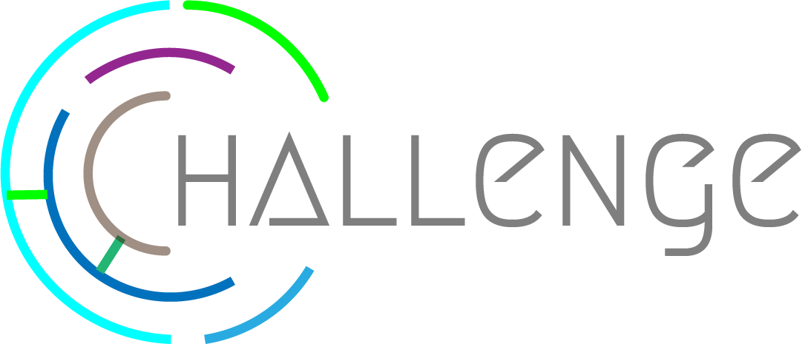

<h1 align="center">Challenge</h1>
 

<h3> :scroll: Descripción.</h3>
     
    
Challenge es un juego en el cual deberás completar los desafios en la menor cantidad de intentos posibles,
    la pagina lleva un registro de cada uno de ellos.

     
<h3> :telescope: Objetivo general</h3>
    

    Se busca crear una plataforma web en la cual, por medio de mis habilidades actuales pueda desarrollar un mini juego junto con una pagina medianamente responsive.
    

     
<h3> :clipboard: Objetivos especificos</h3>
    <ol>
        <li>Desarrollar una pagina web amigable</li>
        <li>Desarrollar una pequeña base de datos para llevar el registro de los mejores jugadores</li>
        <li>Pasar a la siguiente ronda. :trollface: </li>
    </ol>
<h3> :wrench: Planteamiento del problema.</h3>
    

 Debido a que se requiere demostrar las capacidades que tiene el concursante, se ve la necesidad de poner un reto para poner a prueba sus habilidades, para ello se desarrolla la pagina web.
    

<h3 align="center"> :rocket: Alcance del proyecto.</h3>
    

    Con este mini proyecto se espera pasar a la siguiente ronda para mantener viva la llama de la esperanza
    :trollface: :fire:
    
